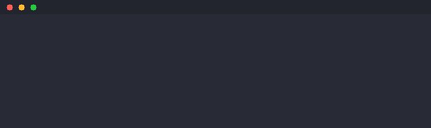
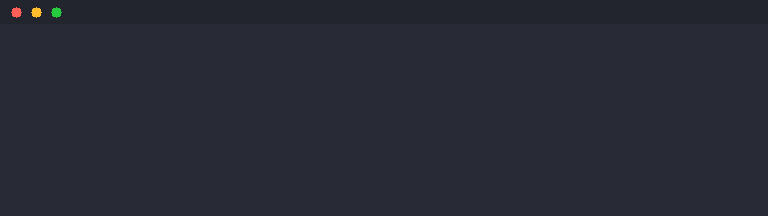

# asciinema-win + Rich-Ruby

[](https://www.ruby-lang.org/)
[](https://github.com/tigel-agm/asciinema-windows)
[](LICENSE)
[](https://github.com/tigel-agm/asciinema-windows)
[](https://rubygems.org/gems/asciinema_win)

> **Native Windows Terminal Recorder and Rich Text Library in Pure Ruby**

Record terminal sessions, export to GIF/MP4/WebM video, and render beautiful formatted output—all with zero external dependencies (except FFmpeg for video export).

---

## Demo

**Rich-Ruby Terminal Recording exported to GIF:**



The GIF above shows Rich-Ruby components (Panel, Table, Tree, Syntax Highlighting, Progress Bar) rendered correctly with ANSI colors. Created with `examples/rich_ruby_demo.rb` and exported using the pure Ruby PPM frame renderer.

<details>
<summary><strong>Common rendering issues and solutions</strong></summary>

**Issue 1: Literal markup tags instead of colors**

If you see `[blue]text[/]` instead of colored text, the Rich-Ruby markup wasn't parsed:


**Solution:** Use `Rich::Text.from_markup()` or `Rich::Console.print()` to properly parse markup before recording.

---

**Issue 2: Missing progress bar blocks**

If percentage increases but the bar is empty, Unicode block characters weren't in the font:



**Solution:** This was fixed in v0.2.0. The embedded font now includes block elements (█ ░ ▒ ▓) and box-drawing characters.

</details>

---

## Table of Contents

- [asciinema-win](#asciinema-win)
  - [Features](#asciinema-features)
  - [Quick Start](#asciinema-quick-start)
  - [CLI Reference](#cli-reference)
  - [Ruby API](#ruby-api)
  - [Export Formats](#export-formats)
- [Rich-Ruby](#rich-ruby)
  - [Features](#rich-ruby-features)
  - [Quick Start](#rich-ruby-quick-start)
  - [Usage Guide](#usage-guide)
- [Requirements](#requirements)
- [Installation](#installation)
- [Documentation](#documentation)
- [License](#license)

---

# asciinema-win

Record and playback terminal sessions on native Windows with accurate timing and full color support. Export to video formats (GIF, MP4, WebM) using a pure Ruby frame renderer.

<a name="asciinema-features"></a>
## Features

**Core**
- Zero external dependencies (pure Ruby + Fiddle for Win32 API)
- Native Windows Console API access
- asciicast v2 format (compatible with asciinema.org)

**Recording**
- Screen buffer capture with colors and attributes
- Microsecond-accurate timing
- Idle time limiting
- Command recording mode

**Export**
- Native: HTML, SVG, Text, JSON (no dependencies)
- Video: GIF, MP4, WebM (requires FFmpeg)
- 9 terminal color themes
- Pure Ruby PPM frame renderer with embedded VGA font

**Playback**
- Accurate timing reproduction
- Adjustable speed (0.5x to 4x)

<a name="asciinema-quick-start"></a>
## Quick Start

> **Note:** Use the full Ruby path: `C:\RubyMSVC34\bin\ruby.exe`

### Record a Terminal Session

```powershell
C:\RubyMSVC34\bin\ruby.exe -Ilib exe\asciinema_win rec session.cast
# Press Ctrl+D to stop recording
```

### Record a Specific Command

```powershell
C:\RubyMSVC34\bin\ruby.exe -Ilib exe\asciinema_win rec -c "dir /s" output.cast
```

### Play Back a Recording

```powershell
C:\RubyMSVC34\bin\ruby.exe -Ilib exe\asciinema_win play session.cast
```

### Play at 2x Speed

```powershell
C:\RubyMSVC34\bin\ruby.exe -Ilib exe\asciinema_win play -s 2 session.cast
```

### Get Recording Info

```powershell
C:\RubyMSVC34\bin\ruby.exe -Ilib exe\asciinema_win info session.cast
```

### Export to HTML

```powershell
C:\RubyMSVC34\bin\ruby.exe -Ilib exe\asciinema_win export session.cast -o session.html
```

<a name="cli-reference"></a>
## CLI Reference

### `asciinema_win rec`

Record a terminal session.

```
Usage: asciinema_win rec [options] <filename>

Options:
  -t, --title <title>         Recording title
  -c, --command <cmd>         Record specific command
  -i, --idle-time-limit <s>   Max idle time (default: 2.0)
  -y, --overwrite             Overwrite existing file
```

### `asciinema_win play`

Play back a recording.

```
Usage: asciinema_win play [options] <filename>

Options:
  -s, --speed <factor>        Playback speed (default: 1.0)
  -i, --idle-time-limit <s>   Max idle time between frames
  -m, --pause-on-markers      Pause at marker events
```

### `asciinema_win export`

Export to other formats.

```
Usage: asciinema_win export [options] <filename>

Formats:
  html   Standalone HTML with embedded player
  svg    SVG image snapshot
  txt    Plain text (ANSI stripped)
  json   Normalized JSON
  gif    Animated GIF (requires FFmpeg)
  mp4    MP4 video (requires FFmpeg)
  webm   WebM video (requires FFmpeg)

Options:
  -f, --format <fmt>    Output format
  -o, --output <file>   Output file path
  -t, --title <title>   Title for HTML export
  --fps <n>             Frames per second for video (default: 10)
  --theme <name>        Color theme for video export
  --scale <n>           Scale factor for video output
```

### `asciinema_win cat`

Output to stdout without timing.

```
Usage: asciinema_win cat <filename>
```

### `asciinema_win info`

Show recording metadata.

```
Usage: asciinema_win info <filename>
```

<a name="ruby-api"></a>
## Ruby API

### Recording

```ruby
require 'asciinema_win'

# Record an interactive session
AsciinemaWin.record("session.cast", title: "My Demo")

# Record a command
AsciinemaWin.record("command.cast", command: "dir /s")
```

### Playback

```ruby
require 'asciinema_win'

# Simple playback
AsciinemaWin.play("session.cast")

# With options
AsciinemaWin.play("session.cast", speed: 2.0)
```

### Export

```ruby
require 'asciinema_win'

# Export to HTML
AsciinemaWin::Export.export("session.cast", "output.html", format: :html)

# Export to SVG with theme
AsciinemaWin::Export.export("session.cast", "output.svg", format: :svg, theme: "dracula")
```

### Creating Recordings Programmatically

```ruby
require 'asciinema_win'

AsciinemaWin::Asciicast.create("demo.cast", width: 80, height: 24) do |writer|
  writer.write_output(0.0, "Hello ")
  writer.write_output(0.5, "\e[32mWorld!\e[0m\r\n")
  writer.write_marker(1.0, "greeting done")
end
```

<a name="export-formats"></a>
## Export Formats

| Format | Extension | Dependencies | Description |
|--------|-----------|--------------|-------------|
| Cast   | `.cast`   | None         | Asciicast v2 (with speed/trim options) |
| HTML   | `.html`   | None         | Standalone page with asciinema-player |
| SVG    | `.svg`    | None         | Colored terminal snapshot with themes |
| Text   | `.txt`    | None         | Plain text with ANSI stripped |
| JSON   | `.json`   | None         | Normalized event data |
| GIF    | `.gif`    | FFmpeg       | Animated GIF (2-pass palette) |
| MP4    | `.mp4`    | FFmpeg       | H.264 video (yuv420p) |
| WebM   | `.webm`   | FFmpeg       | VP9 video |

### Video Export (GIF/MP4/WebM)

Export recordings to video formats using FFmpeg. Uses a pure Ruby PPM frame
renderer with an embedded 8x16 VGA bitmap font—no external libraries needed
except FFmpeg itself.

**CLI Examples:**

```powershell
# Export to GIF (default 10 FPS)
C:\RubyMSVC34\bin\ruby.exe -Ilib exe\asciinema_win export demo.cast -o demo.gif

# Export to GIF with custom FPS and theme
C:\RubyMSVC34\bin\ruby.exe -Ilib exe\asciinema_win export demo.cast -o demo.gif --fps 15 --theme dracula

# Export to MP4
C:\RubyMSVC34\bin\ruby.exe -Ilib exe\asciinema_win export demo.cast -o demo.mp4 --fps 30

# Export to WebM
C:\RubyMSVC34\bin\ruby.exe -Ilib exe\asciinema_win export demo.cast -o demo.webm
```

**Ruby API:**

```ruby
require 'asciinema_win'

# Export to GIF with options
AsciinemaWin::Export.export("demo.cast", "demo.gif",
  format: :gif,
  fps: 15,
  theme: "dracula"
)

# Export to MP4
AsciinemaWin::Export.export("demo.cast", "demo.mp4", format: :mp4, fps: 30)

# Export to WebM
AsciinemaWin::Export.export("demo.cast", "demo.webm", format: :webm)
```

> **Note:** GIF export uses 2-pass palette optimization (`palettegen` + `paletteuse`)
> for high-quality output with proper dithering.

### Terminal Themes

SVG exports support multiple color themes:

- `asciinema` (default)
- `dracula`
- `monokai`
- `solarized-dark`
- `solarized-light`
- `nord`
- `one-dark`
- `github-dark`
- `tokyo-night`

```ruby
# Export with Dracula theme
AsciinemaWin::Export.export("demo.cast", "demo.svg", format: :svg, theme: "dracula")

# List available themes
AsciinemaWin::Themes.names  # => ["asciinema", "dracula", "monokai", ...]
```

### Speed Adjustment & Idle Compression

```ruby
# Speed up playback 2x
AsciinemaWin::Export.adjust_speed("input.cast", "output.cast", speed: 2.0)

# Compress idle time to max 0.5s
AsciinemaWin::Export.adjust_speed("input.cast", "output.cast", max_idle: 0.5)

# Both
AsciinemaWin::Export.adjust_speed("input.cast", "output.cast", speed: 1.5, max_idle: 0.5)
```

### Recording Concatenation

```ruby
# Combine multiple recordings
AsciinemaWin::Export.concatenate(
  ["part1.cast", "part2.cast", "part3.cast"],
  "combined.cast",
  title: "Full Demo",
  gap: 1.0  # seconds between recordings
)
```

### Thumbnail Generation

```ruby
# Generate thumbnail from last frame
AsciinemaWin::Export.thumbnail("demo.cast", "thumb.svg", frame: :last, theme: "dracula")

# Other frame options: :first, :middle, or specific time in seconds
AsciinemaWin::Export.thumbnail("demo.cast", "thumb.svg", frame: :middle)
AsciinemaWin::Export.thumbnail("demo.cast", "thumb.svg", frame: 5.0)  # at 5s
```

### Organized Output

Use `OutputOrganizer` for structured output directories:

```ruby
# Create a session
session = AsciinemaWin::OutputOrganizer.create_session("my_demo")

# Get paths for various outputs
recording = session.recording_path("demo")     # asciinema_output/recordings/my_demo_YYYYMMDD_HHMMSS/demo.cast
svg_path = session.export_path("demo", format: :svg)  # asciinema_output/svg/my_demo_YYYYMMDD_HHMMSS/demo.svg
thumb = session.thumbnail_path("demo", frame: :last)  # asciinema_output/thumbnails/svg/.../demo_last.svg

# View session summary
puts session.summary
```

Output directory structure:
```
asciinema_output/
├── recordings/
│   └── my_demo_20251224_120000/
│       └── demo.cast
├── svg/
│   └── my_demo_20251224_120000/
│       ├── demo_asciinema.svg
│       ├── demo_dracula.svg
│       └── ...
├── html/
│   └── my_demo_20251224_120000/
│       └── demo.html
├── json/
├── text/
├── thumbnails/
│   └── svg/
│       └── my_demo_20251224_120000/
│           ├── demo_first.svg
│           ├── demo_middle.svg
│           └── demo_last.svg
└── video/
```

---

# Rich-Ruby

A Pure Ruby library for rich text and beautiful formatting in the terminal.

<a name="rich-ruby-features"></a>
## Features

- **Colors**: 16-color, 256-color, and TrueColor (24-bit)
- **Styles**: Bold, italic, underline, strikethrough, blink, reverse
- **Markup**: `[bold red]text[/]` syntax for inline styling
- **Panels**: Bordered boxes with titles
- **Tables**: Data tables with alignment and styling
- **Trees**: Hierarchical tree views
- **Progress**: Animated progress bars and spinners
- **Syntax**: Code highlighting for Ruby, Python, JavaScript, SQL
- **Markdown**: Render Markdown in the terminal
- **Windows**: Full Windows Console API support

<a name="rich-ruby-quick-start"></a>
## Quick Start

```ruby
require 'rich'

# Simple styled output
Rich.print("[bold cyan]Hello[/] [yellow]World![/]")

# Create a console for more control
console = Rich::Console.new
console.print("Welcome!", style: "bold green")

# Display a panel
panel = Rich::Panel.new(
  "This is important information.",
  title: "Notice",
  border_style: "cyan"
)
puts panel.render(max_width: 50)

# Display a table
table = Rich::Table.new(title: "Users")
table.add_column("Name", header_style: "bold")
table.add_column("Role")
table.add_row("Alice", "Admin")
table.add_row("Bob", "User")
puts table.render(max_width: 40)
```

<a name="usage-guide"></a>
## Usage Guide

### Colors and Styles

```ruby
# Named colors
Rich.print("[red]Error[/] [green]Success[/] [blue]Info[/]")

# 256 colors
Rich.print("[color(208)]Orange[/]")

# RGB colors
Rich.print("[rgb(255,100,50)]Custom[/]")

# Background colors
Rich.print("[white on blue]Highlighted[/]")

# Styles
Rich.print("[bold]Bold[/] [italic]Italic[/] [underline]Underline[/]")
```

### Panels

```ruby
panel = Rich::Panel.new(
  "Content here",
  title: "Title",
  subtitle: "Subtitle",
  border_style: "green",
  padding: [1, 2]
)
puts panel.render(max_width: 60)
```

### Tables

```ruby
table = Rich::Table.new(title: "Data", show_header: true)
table.add_column("ID", justify: :right)
table.add_column("Name", justify: :left)
table.add_column("Value", justify: :center)
table.add_row("1", "Item A", "100")
table.add_row("2", "Item B", "200")
puts table.render
```

### Trees

```ruby
tree = Rich::Tree.new("Root")
child1 = tree.add("Child 1")
child1.add("Grandchild 1")
child1.add("Grandchild 2")
tree.add("Child 2")
puts tree.render
```

### Progress Bars

```ruby
progress = Rich::Progress.new("Processing", total: 100)
100.times do |i|
  progress.update(i + 1)
  sleep(0.05)
end
progress.complete!
```

### Syntax Highlighting

```ruby
code = 'def hello; puts "Hello"; end'
syntax = Rich::Syntax.new(code, "ruby", theme: "monokai")
puts syntax.render
```

---

# Requirements

- **Ruby**: 3.0+ (tested on 3.4.8 MSVC)
- **Platform**: Windows 10/11 (asciinema-win requires Windows)
- **Dependencies**: None (zero external gems)

### Development Environment

```
C:\RubyMSVC34                 # Ruby installation
C:\Users\#yourusername\vcpkg           # Dependencies
C:\Program Files\Microsoft Visual Studio\18\Community  # VS 2026
```

---

# Installation

### From Source

```powershell
git clone https://github.com/tigel-agm/asciinema-win.git
cd asciinema-win
```

### Build and Install Gem

```powershell
C:\RubyMSVC34\bin\gem.cmd build asciinema_win.gemspec
C:\RubyMSVC34\bin\gem.cmd install asciinema_win-0.2.0.gem
```

---

# Documentation

- [docs/how-to-use.md](docs/how-to-use.md) - Rich-Ruby usage guide
- [docs/troubleshooting.md](docs/troubleshooting.md) - Solutions for common issues
- [docs/windows-notes.md](docs/windows-notes.md) - Windows-specific details
- [docs/cheat-sheet.md](docs/cheat-sheet.md) - Quick reference

---

# Project Structure

```
asciinema-win/
├── asciinema_win.gemspec       # Gem specification
├── exe/
│   └── asciinema_win           # CLI executable
├── lib/
│   ├── asciinema_win.rb        # asciinema-win entry point
│   ├── asciinema_win/
│   │   ├── version.rb
│   │   ├── screen_buffer.rb    # Screen capture
│   │   ├── asciicast.rb        # File format
│   │   ├── recorder.rb         # Recording engine
│   │   ├── player.rb           # Playback engine
│   │   ├── export.rb           # Export formats
│   │   └── cli.rb              # CLI
│   └── rich/                   # Rich-Ruby library
│       ├── console.rb
│       ├── text.rb
│       ├── panel.rb
│       ├── table.rb
│       ├── tree.rb
│       ├── progress.rb
│       ├── syntax.rb
│       ├── markdown.rb
│       └── win32_console.rb    # Windows API
├── examples/
│   ├── test_capture.rb
│   ├── rich_ruby_recording_demo.rb
│   └── create_sample_recording.rb
└── docs/
    └── ...
```

---

# File Format

asciinema-win uses **asciicast v2** format (newline-delimited JSON):

```json
{"version":2,"width":80,"height":24,"timestamp":1735052000,"title":"Demo"}
[0.0,"o","Hello "]
[0.5,"o","\u001b[32mWorld!\u001b[0m\r\n"]
[1.0,"m","marker label"]
```

Event types:
- `"o"` - Output (terminal data)
- `"i"` - Input (keyboard)
- `"r"` - Resize (`"80x24"`)
- `"m"` - Marker (bookmark)

---

# License

MIT License - See [LICENSE](LICENSE)

---

# Credits

- Inspired by [asciinema](https://asciinema.org)
- Rich-Ruby inspired by Python's [Rich](https://github.com/Textualize/rich)
- Developed on Ruby 3.4.8 (MSVC) on Windows
